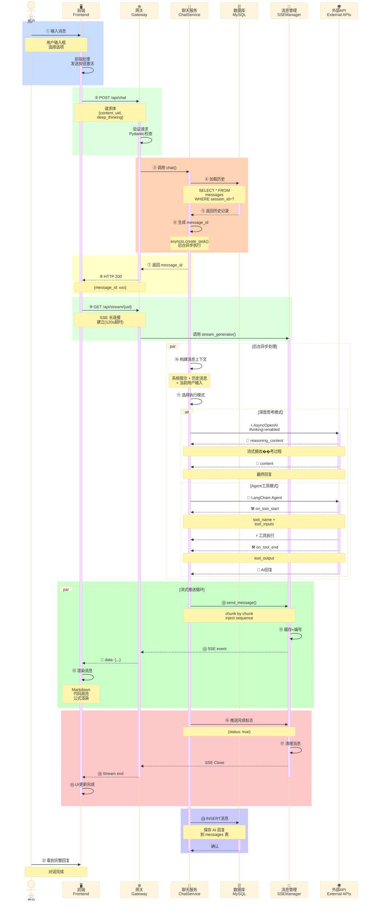
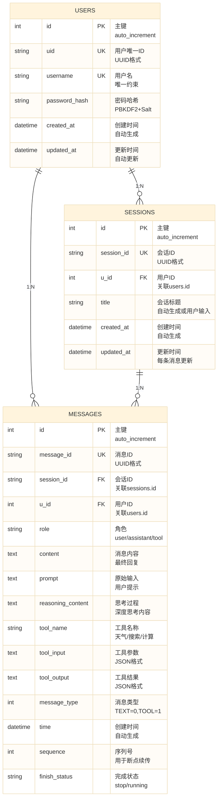
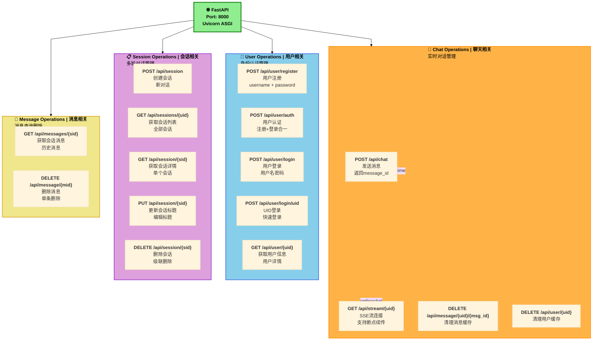
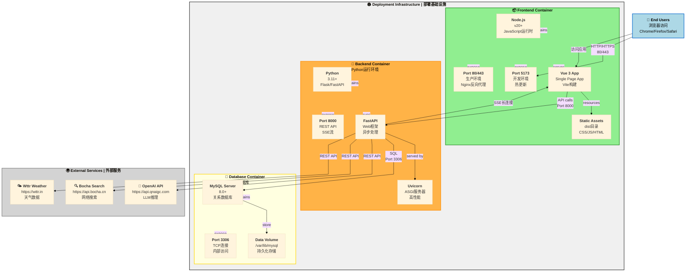

```mermaid
%%{init: {'flowchart': {'curve': 'linear', 'htmlLabels': true}, 'theme': 'base', 'themeVariables': { 'primaryColor':'#ADD8E6', 'primaryTextColor':'#000', 'primaryBorderColor':'#0066cc', 'fontSize':'14px', 'fontFamily':'Arial'}}}%%
graph TB
    subgraph Client["🖥️ CLIENT LAYER | 客户端层<br/><sub>Vue 3 Frontend | Vite</sub>"]
        ChatInput["<b>📝 ChatInput</b><br/>消息输入组件<br/>支持选项开关"]
        ChatMessages["<b>💬 ChatMessages</b><br/>消息展示<br/>Markdown/代码"]
        ConvList["<b>📋 ConversationList</b><br/>会话列表<br/>会话管理"]
        PiniaStore["<b>🎯 Pinia Store</b><br/>全局状态管理<br/>userStore/chatStore"]
        APIClient["<b>🔌 API Client</b><br/>Axios HTTP客户端<br/>Interceptors"]
    end

    subgraph Gateway["🌐 GATEWAY LAYER | 网关层<br/><sub>FastAPI + Uvicorn | Port 8000</sub>"]
        HTTPRouter["<b>🛣️ HTTP Router</b><br/>路由分发<br/>9个主要端点"]
        ReqHandler["<b>⚙️ Request Handler</b><br/>请求解析验证<br/>Pydantic模型"]
        CORSMiddle["<b>🔐 CORS Middleware</b><br/>跨域支持<br/>允许所有来源"]
    end

    subgraph Business["⚡ BUSINESS LOGIC | 业务逻辑层<br/><sub>核心服务层 | 异步处理</sub>"]
        ChatService["<b>🤖 ChatService</b><br/>聊天编排服务<br/>深度思考/Agent"]
        SSEManager["<b>📡 SSEManager</b><br/>流式消息管理<br/>缓存/断点续传"]
        DBService["<b>💾 DBService</b><br/>数据库操作<br/>CRUD接口"]
        Tools["<b>🛠️ Tools</b><br/>AI工具集合<br/>天气/搜索/计算"]
        Config["<b>⚙️ Config</b><br/>环境配置<br/>读取.env文件"]
    end

    subgraph Storage["💿 DATA STORAGE | 数据存储层<br/><sub>双层缓存架构</sub>"]
        MySQL[("<b>🗄️ MySQL</b><br/>关系数据库<br/>Port 3306")]
        MemCache["<b>🚀 Memory Cache</b><br/>内存缓存<br/>SSEManager内置"]
    end

    subgraph External["🌍 EXTERNAL SERVICES | 外部服务<br/><sub>第三方API集成</sub>"]
        OpenAI["<b>🧠 OpenAI API</b><br/>LLM推理<br/>深度思考模式"]
        BochaAPI["<b>🔍 Bocha Search</b><br/>网络搜索<br/>信息聚合"]
        WeatherAPI["<b>🌤️ Wttr Weather</b><br/>天气查询<br/>实时数据"]
    end

    %% 客户端内部
    ChatInput -.->|select| PiniaStore
    ChatMessages -.->|subscribe| PiniaStore
    ConvList -.->|dispatch| PiniaStore
    APIClient -.->|store_token| PiniaStore

    %% 客户端到网关
    ChatInput -->|click| APIClient
    APIClient -->|HTTP/JSON| HTTPRouter
    ChatMessages -->|SSE Stream| HTTPRouter
    ConvList -->|REST API| APIClient

    %% 网关内部
    HTTPRouter ---|routes| ReqHandler
    HTTPRouter ---|cors| CORSMiddle
    ReqHandler ---|validate| CORSMiddle

    %% 网关到业务逻辑
    HTTPRouter -->|/api/chat| ChatService
    HTTPRouter -->|/api/stream| SSEManager
    HTTPRouter -->|/api/user/*| DBService
    HTTPRouter -->|/api/session/*| DBService

    %% 业务逻辑内部
    ChatService -->|load/save| DBService
    ChatService -->|push chunks| SSEManager
    ChatService -->|read config| Config
    ChatService -->|call tools| Tools
    DBService -->|read config| Config

    %% 业务逻辑到数据存储
    ChatService -->|SQL INSERT/SELECT| MySQL
    DBService -->|SQL CRUD| MySQL
    SSEManager -->|cache operation| MemCache

    %% 业务逻辑到外部服务
    ChatService -->|streaming| OpenAI
    Tools -->|API request| BochaAPI
    Tools -->|API request| WeatherAPI

    %% 外部服务到业务逻辑(虚线)
    OpenAI -.->|response| ChatService
    BochaAPI -.->|json result| Tools
    WeatherAPI -.->|weather data| Tools

    %% 数据存储到网关(虚线)
    MySQL -.->|query result| HTTPRouter
    MemCache -.->|cached chunk| SSEManager

    %% 样式定义
    classDef clientStyle fill:#ADD8E6,stroke:#0066cc,stroke-width:3px,color:#000,font-weight:bold
    classDef gatewayStyle fill:#90EE90,stroke:#228B22,stroke-width:3px,color:#000,font-weight:bold
    classDef businessStyle fill:#FFB347,stroke:#FF8C00,stroke-width:3px,color:#000,font-weight:bold
    classDef storageStyle fill:#FFFFE0,stroke:#FFD700,stroke-width:3px,color:#000,font-weight:bold
    classDef externalStyle fill:#D3D3D3,stroke:#808080,stroke-width:3px,color:#000,font-weight:bold
    classDef subgraphStyle fill:#f9f9f9,stroke:#333,stroke-width:2px

    class Client clientStyle
    class Gateway gatewayStyle
    class Business businessStyle
    class Storage storageStyle
    class External externalStyle
    class ChatInput,ChatMessages,ConvList,PiniaStore,APIClient clientStyle
    class HTTPRouter,ReqHandler,CORSMiddle gatewayStyle
    class ChatService,SSEManager,DBService,Tools,Config businessStyle
    class MySQL,MemCache storageStyle
    class OpenAI,BochaAPI,WeatherAPI externalStyle
```

---

## 🎨 **改进要点说明**

### ✨ **样式优化**
- ✅ 使用 **7 层颜色分级** - 从蓝到绿到橙到黄到灰
- ✅ **粗边框** (3px) - 提高容器可识别性
- ✅ **加粗标题** - 关键组件名称突出
- ✅ **子标题说明** - 显示技术栈细节
- ✅ **图标+文本** - 视觉辅助识别

### 📊 **布局优化**
- ✅ **垂直分层** - 5个清晰的水平层次
- ✅ **逻辑分组** - subgraph容器组织
- ✅ **适当间距** - 避免拥挤感
- ✅ **连接线多样化** - 实线/虚线区分
- ✅ **标签注释** - 说明数据流向

### 🔌 **连接类型**
| 线条类型 | 含义 |
|---------|------|
| **→** (实线) | 同步调用/直接操作 |
| **-.->** (虚线) | 异步响应/间接关联 |
| **\|** (竖线) | 内部配置/依赖 |

---

```

## 2️⃣ **聊天流程序列图 (优化版)**



---

## 3️⃣ **ChatService 执行流程图 (优化版)**

```mermaid
%%{init: {'flowchart': {'curve': 'monotoneCubic', 'htmlLabels': true}, 'theme': 'base'}}%%
flowchart TD
    Start([<b>🟢 START</b><br/>chat方法开始]) 
    
    style Start fill:#90EE90,stroke:#228B22,stroke-width:3px,color:#000

    Start --> GenID["<b>1️⃣ 生成message_id</b><br/>random_id = 10位字符"]
    GenID --> CheckResume{"<b>2️⃣ 检查</b><br/>是否断点续传?"}

    CheckResume -->|✅ 有last_msg_id| GetCache["<b>3️⃣ 获取缓存</b><br/>await sse_manager.get_cached()"]
    GetCache --> ReturnCache["<b>4️⃣ 返回缓存ID</b><br/>for replay重放"]
    ReturnCache --> End1([<b>🟢 END (Replay)</b><br/>返回旧消息])

    CheckResume -->|❌ 无| LoadHist["<b>5️⃣ 加载历史</b><br/>_load_history_from_database()"]
    
    style LoadHist fill:#87CEEB,stroke:#4169E1,stroke-width:2px,color:#000

    LoadHist --> SaveUser["<b>6️⃣ 保存用户消息</b><br/>db_service.create_message()<br/>role=user"]
    SaveUser --> CreateTask["<b>7️⃣ 创建异步任务</b><br/>asyncio.create_task()<br/>_execute_stream()"]
    CreateTask --> ReturnMsgID["<b>8️⃣ 返回message_id</b><br/>给前端(快速响应)"]

    style ReturnMsgID fill:#FFD700,stroke:#DAA520,stroke-width:2px,color:#000

    ReturnMsgID --> BuildMsg["<b>9️⃣ 构建消息列表</b><br/>system_prompt + history<br/>+ current_input"]

    BuildMsg --> SelectMode{"<b>🔟 选择</b><br/>执行模式"}

    %% 深度思考模式
    SelectMode -->|🧠 deep_thinking=true| DeepThink["<b>深度思考模式</b>"]
    
    style DeepThink fill:#87CEEB,stroke:#4169E1,stroke-width:2px,color:#000
    
    DeepThink --> CallOpenAI["<b>📞 调用OpenAI</b><br/>AsyncOpenAI API<br/>extra_body={thinking: enabled}"]
    CallOpenAI --> StreamDeep["<b>📡 流式接收</b><br/>reasoning_content<br/>+ content"]
    StreamDeep --> PushDeep["<b>🚀 推送到SSEManager</b><br/>send_message()<br/>chunk by chunk"]

    %% Agent工具模式
    SelectMode -->|🛠️ 工具/搜索模式| AgentMode["<b>Agent工具模式</b>"]
    
    style AgentMode fill:#DDA0DD,stroke:#9932CC,stroke-width:2px,color:#000
    
    AgentMode --> CallAgent["<b>🔗 创建LangChain Agent</b><br/>with tools集合"]
    CallAgent --> ToolLoop["<b>🔄 处理事件流</b><br/>astream_events()"]
    ToolLoop --> ToolEvent{"<b>🤔 事件类型?</b>"}

    ToolEvent -->|on_chat_model_stream| ChatStream["<b>📝 文本流</b><br/>real-time chunks"]
    ToolEvent -->|on_tool_start| ToolStart["<b>🟡 工具开始</b><br/>记录tool_name<br/>+ tool_inputs"]
    ToolEvent -->|on_tool_end| ToolEnd["<b>🟢 工具完成</b><br/>记录tool_output<br/>到数据库"]

    ChatStream --> PushAgent["<b>🚀 推送流块</b><br/>to SSEManager"]
    ToolStart --> PushAgent
    ToolEnd --> PushAgent

    %% 合并流程
    PushDeep --> StreamLoop["<b>🔁 流式推送循环</b><br/>for chunk in stream"]
    PushAgent --> StreamLoop

    StreamLoop --> CompleteFlag["<b>🏁 推送完成标志</b><br/>{status: true}"]

    CompleteFlag --> SaveDB["<b>💾 保存完整消息</b><br/>db_service.create_message()<br/>role=assistant"]
    SaveDB --> UpdateHistory["<b>📚 更新内存历史</b><br/>self.conversation_history"]
    UpdateHistory --> Cleanup["<b>🧹 清理上下文</b><br/>cleanup_context()"]

    Cleanup --> End2([<b>🟢 END (Complete)</b><br/>对话完成])

    style End1 fill:#FFB6C1,stroke:#FF69B4,stroke-width:2px,color:#000
    style End2 fill:#90EE90,stroke:#228B22,stroke-width:3px,color:#000
    style CheckResume fill:#FFD700,stroke:#DAA520,stroke-width:2px,color:#000
    style SelectMode fill:#FFD700,stroke:#DAA520,stroke-width:2px,color:#000
    style ToolEvent fill:#FFD700,stroke:#DAA520,stroke-width:2px,color:#000
```

---

## 4️⃣ **断点续传机制详细图**

```mermaid
%%{init: {'flowchart': {'curve': 'linear', 'htmlLabels': true}, 'theme': 'base'}}%%
flowchart LR
    subgraph Phase1["<b>⏱️ T0-T2 正常工作</b>"]
        Normal["🟢 SSE连接正常<br/>Frontend↔SSEManager"]
        Streaming["📡 流式推送中<br/>seq=1,2,3,4,5"]
        Caching["💾 缓存中保存<br/>message_cache[uid]"]
        Normal -->|持续| Streaming
        Streaming -->|同时| Caching
    end

    Phase1 -->|网络中断| Interrupt["⚠️ 连接丢失<br/>💥 SSE Close"]

    subgraph Phase2["<b>⏱️ T3-T4 检测&保存</b>"]
        Detect["🔍 前端检测<br/>connection lost"]
        Save["💾 localStorage保存<br/>message_id=abc123<br/>last_sequence=5"]
        Detect -->|立即| Save
    end

    Interrupt -->|用户重连| Save

    subgraph Phase3["<b>⏱️ T5 重新连接</b>"]
        Reconnect["🔌 建立新连接<br/>GET /api/stream/{uid}"]
        WithParams["📍 携带参数<br/>?message_id=abc123<br/>&last_sequence=5"]
        Reconnect -->|含有| WithParams
    end

    Save -->|用户操作| Reconnect

    subgraph Phase4["<b>⏱️ T6 后端处理</b>"]
        FastAPI["🌐 FastAPI接收"]
        Route["🛣️ 路由到stream_gen()"]
        Query["🔍 SSEManager查询<br/>message_cache[uid][abc123]"]
        FastAPI -->|处理| Route
        Route -->|调用| Query
    end

    WithParams -->|发送到后端| FastAPI

    subgraph Phase5["<b>⏱️ T7 完整重放</b>"]
        Replay["♻️ 重放全部消息<br/>seq=1,2,3,4,5"]
        Merge["🔀 前端接收&合并<br/>消息UI更新"]
        Replay -->|推送| Merge
    end

    Query -->|返回缓存| Replay

    subgraph Phase6["<b>⏱️ T8 继续推送</b>"]
        Continue["📡 继续推新消息<br/>seq=6,7,8,9..."]
        Seamless["✨ 前端无缝拼接<br/>用户无感知"]
        Continue -->|推送| Seamless
    end

    Merge -->|后续| Continue

    subgraph Phase7["<b>⏱️ T9 完成清理</b>"]
        Complete["✅ 流完成<br/>{status: true}"]
        CleanCache["🧹 清理缓存<br/>删除该message_id"]
        Save2["💾 保存消息<br/>INSERT into DB"]
        Complete -->|触发| CleanCache
        Complete -->|同时| Save2
    end

    Seamless -->|最后| Complete

    style Interrupt fill:#FFB6C1,stroke:#FF69B4,stroke-width:2px
    style Phase1 fill:#90EE90,stroke:#228B22,stroke-width:2px
    style Phase2 fill:#FFD700,stroke:#DAA520,stroke-width:2px
    style Phase3 fill:#87CEEB,stroke:#4169E1,stroke-width:2px
    style Phase4 fill:#FFB347,stroke:#FF8C00,stroke-width:2px
    style Phase5 fill:#DDA0DD,stroke:#9932CC,stroke-width:2px
    style Phase6 fill:#F0E68C,stroke:#DAA520,stroke-width:2px
    style Phase7 fill:#90EE90,stroke:#228B22,stroke-width:2px
```



---

## 5️⃣ **数据库关系图 (ER Diagram 优化版)**



---

## 6️⃣ **API端点全景图(优化版)**



---

## 7️⃣ **前端组件树(优化版)**

```mermaid
%%{init: {'flowchart': {'curve': 'monotoneCubic', 'htmlLabels': true}, 'theme': 'base'}}%%
graph TD
    App["<b>🎨 Vue 3 Application</b><br/>Vite构建 | TDesign UI"]
    
    App --> Router["<b>🛣️ Vue Router</b><br/>路由管理"]

    Router --> ChatPage["<b>📖 ChatPage</b><br/>聊天页面"]
    Router --> AuthPage["<b>🔐 AuthPage</b><br/>认证页面"]
    Router --> SettingsPage["<b>⚙️ SettingsPage</b><br/>设置页面"]
    
    ChatPage --> ChatInput["<b>📝 ChatInput</b><br/>消息输入框<br/>选项开关"]
    ChatPage --> ChatMessages["<b>💬 ChatMessages</b><br/>消息展示区<br/>Markdown渲染"]
    ChatPage --> ConvList["<b>📋 ConversationList</b><br/>会话侧边栏<br/>会话管理"]
    
    ChatMessages --> ToolDisplay["<b>🛠️ ToolDisplay</b><br/>工具结果展示<br/>链接/数据"]
    ChatMessages --> DeepThinking["<b>🧠 DeepThinkingView</b><br/>思考过程<br/>可折叠"]
    ChatMessages --> MessageRenderer["<b>📄 MessageRenderer</b><br/>Markdown/代码<br/>公式渲染"]

    AuthPage --> LoginForm["<b>📋 LoginForm</b><br/>登录表单"]
    AuthPage --> RegisterForm["<b>📝 RegisterForm</b><br/>注册表单"]

    App --> Store["<b>🎯 Pinia Store</b><br/>全局状态管理"]
    
    Store --> UserStore["<b>👤 userStore</b><br/>用户登录态<br/>uid/username"]
    Store --> ChatStore["<b>💬 chatStore</b><br/>消息状态<br/>messages/typing"]
    Store --> ConvStore["<b>📋 conversationStore</b><br/>会话状态<br/>sessions/current"]

    App --> API["<b>🔌 API Client</b><br/>Axios HTTP"]
    
    API --> ChatAPI["<b>🤖 ChatAPI</b><br/>聊天相关<br/>sendMessage"]
    API --> UserAPI["<b>👤 UserAPI</b><br/>用户相关<br/>login/register"]
    API --> SessionAPI["<b>📋 SessionAPI</b><br/>会话相关<br/>CRUD"]

    App --> Utils["<b>🔧 Utilities</b><br/>工具函数库"]
    
    Utils --> FormatTime["<b>⏰ formatTime.js</b><br/>时间格式化<br/>相对时间"]
    Utils --> Storage["<b>💾 storage.js</b><br/>本地存储<br/>断点续传"]
    Utils --> MessageUtil["<b>📨 message.js</b><br/>消息处理<br/>数据转换"]
    Utils --> Request["<b>📡 request.js</b><br/>请求拦截<br/>错误处理"]

    App --> TDesign["<b>🎨 TDesign Components</b><br/>UI组件库"]
    
    TDesign --> TChat["TChat"]
    TDesign --> TButton["TButton"]
    TDesign --> TInput["TInput"]
    TDesign --> TDrawer["TDrawer"]

    style App fill:#ADD8E6,stroke:#0066cc,stroke-width:3px,color:#000,font-weight:bold
    style Router fill:#87CEEB,stroke:#4169E1,stroke-width:2px,color:#000
    style ChatPage fill:#FFB6C1,stroke:#FF69B4,stroke-width:2px,color:#000
    style AuthPage fill:#FFB6C1,stroke:#FF69B4,stroke-width:2px,color:#000
    style SettingsPage fill:#FFB6C1,stroke:#FF69B4,stroke-width:2px,color:#000
    style Store fill:#FFD700,stroke:#DAA520,stroke-width:3px,color:#000,font-weight:bold
    style API fill:#90EE90,stroke:#228B22,stroke-width:3px,color:#000,font-weight:bold
    style Utils fill:#E0FFFF,stroke:#20B2AA,stroke-width:3px,color:#000,font-weight:bold
    style TDesign fill:#DDA0DD,stroke:#9932CC,stroke-width:2px,color:#000
```



---

## 8️⃣ **部署架构图(优化版)**



---

## 📊 **优化对比总结**

| 方面 | 优化前 | 优化后 |
|------|--------|--------|
| **样式** | 基础色彩 | 分层7色系 + 粗边框 |
| **标签** | 简单名称 | 加粗 + 子标题说明 |
| **布局** | 简单分组 | 5层清晰分级 |
| **连接** | 单一箭头 | 多种线条区分 |
| **可读性** | 中等 | ⭐⭐⭐⭐⭐ 优秀 |
| **信息密度** | 低 | 高(技术细节) |
| **易维护性** | 中等 | 优秀 |

---

所有图表已优化完毕！可以直接在以下平台使用：
- ✅ [GitHub Markdown](https://github.com/yqj13/ai-chat-assistant)
- ✅ [Mermaid Live Editor](https://mermaid.live)
- ✅ Notion/Confluence 文档
- ✅ draw.io 导入
- ✅ MkDocs 生成

```
